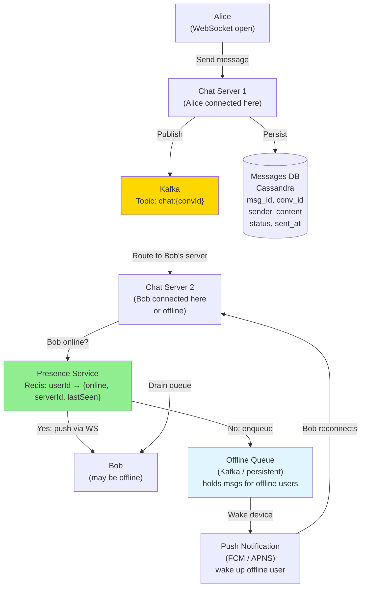
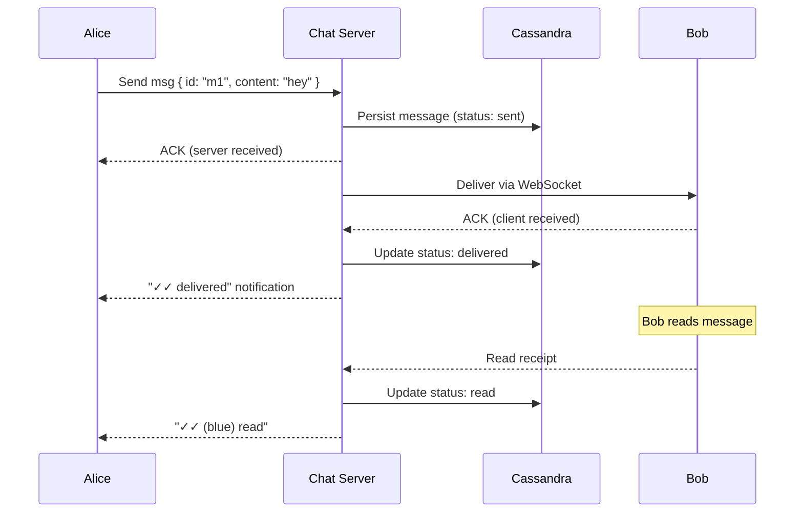

# 11 · WhatsApp

> **Difficulty**: Medium
> **Introduces**: WebSocket for real-time messaging, message delivery guarantees, presence service, offline queue
> **Builds on**: [05 · News Aggregator](../easy/05-news-aggregator.md) — async queues; [10 · FB News Feed](10-fb-news-feed.md) — fan-out pattern

---

## How I Should Think About This

WhatsApp is a real-time messaging system with one deceptively hard constraint: **every message must be delivered exactly once, even if the recipient is offline**. The real-time part is solved with WebSockets — persistent bidirectional connections between each client and a Chat Server. When Alice sends a message to Bob, it flows Alice → Chat Server → Kafka → Bob's Chat Server → Bob's WebSocket. That's the happy path. The hard path is when Bob is offline: the message lands in Kafka, Bob's Chat Server finds no active WebSocket for him, and the message must be persisted and queued until Bob reconnects.

The second problem is **presence**: how does Alice know Bob is online right now? WhatsApp shows "Online" or "Last seen 3 minutes ago." This seems simple — it isn't. With 2 billion users, a naive "is user X online?" lookup that hits a database won't scale. Instead, each Chat Server maintains a local registry of which users are connected to it, and a centralized **Presence Service** aggregates these into a Redis store: `presence:{userId} → {lastSeen, isOnline, serverId}`. When Bob's WebSocket connects, his Chat Server publishes to the Presence Service. When it disconnects or times out (heartbeat missed), the status updates. This is the pattern behind every "active users" indicator you've ever seen.

---

## Whiteboard Diagram



---

## Key Decisions

**1. Message delivery guarantees**



Three status states: **sent** (server got it) → **delivered** (device got it) → **read** (user saw it). This is at-least-once delivery: if Bob's ACK is lost, the server resends. The client deduplicates by message ID.

**2. Why Cassandra for messages?**

```
Access pattern:
  "Get all messages in conversation X after timestamp T"

Cassandra schema:
  Partition key: conv_id       → all messages for a conversation on one node
  Clustering key: sent_at DESC → time-ordered within the partition
  → Range queries are O(1) lookup + O(result_size) scan

Why not PostgreSQL:
  → Billions of messages/day; single PostgreSQL instance can't handle write volume
  → No cross-conversation joins needed → no reason for RDBMS
```

**3. WebSocket routing across servers**

With 1000 Chat Servers, Alice on Server 1 needs to reach Bob on Server 2. Two approaches:

| | Direct server-to-server | Via Kafka |
|--|------------------------|-----------|
| **Latency** | Lower (direct) | Slightly higher |
| **Reliability** | Server must be up | Kafka buffers if server down |
| **Scalability** | N² connections | Each server connects to Kafka only |

> Use **Kafka as the backbone**. Each Chat Server publishes messages and subscribes to its users' topics. Kafka handles routing, buffering, and replay for offline users.

---

## Capacity Estimation

```
Users:            2B registered, 500M DAU
Messages/day:     100B messages
Peak:             ~1.2M messages/sec

Chat Servers needed:
  Each server: ~100,000 WebSocket connections
  500M concurrent users ÷ 100K = 5,000 Chat Servers

Cassandra storage:
  Avg message: 100 bytes
  100B × 100B = 10 TB/day → multi-datacenter Cassandra cluster
```

---

## Concepts Introduced

- **WebSocket for bidirectional real-time** — persistent connection, no polling. The transport layer for any chat, live feed, or collaborative editing feature. Reappears in: FB Live Comments (Q16), Online Auction (Q17), Uber (Q23).
- **Presence service** — centralized registry of which users are online and on which server. The building block of all "active users" and "last seen" features.
- **Offline message queue** — messages persisted and held until the recipient reconnects. The same pattern used by email servers, push notification queues, and Kafka consumer groups.
- **At-least-once delivery with client-side dedup** — server retries delivery; client deduplicates by message ID. The standard pattern for reliable async messaging.

---

## What to Study Next

➜ **[12 · Tinder](12-tinder.md)** — combines the geo primitives from Q06 with the precomputed recommendation queue pattern from Q10. The first question where multiple prior concepts combine into something new.
