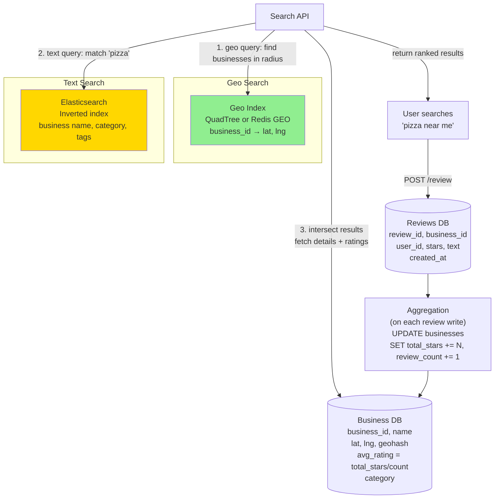

# 13 · Yelp

> **Difficulty**: Medium
> **Introduces**: QuadTree spatial indexing, full-text search, review aggregation pipeline
> **Builds on**: [12 · Tinder](12-tinder.md) — geo indexing; [05 · News Aggregator](../easy/05-news-aggregator.md) — aggregation patterns

---

## How I Should Think About This

Yelp has two distinct search modes that your system must handle simultaneously: **proximity search** ("restaurants near me") and **text search** ("find 'pizza' near me"). Proximity search is a geo problem — solved with GeoHash or QuadTree, exactly as in Tinder. Text search is an entirely different problem — solved with an inverted index (Elasticsearch). The interesting design challenge is that a user query often combines both: "sushi places within 2km rated above 4 stars." You need to efficiently intersect results from two different index types.

The second new concept is **review aggregation**. When a user submits a 3-star review, the business's average rating must update. Naively running `SELECT AVG(rating) FROM reviews WHERE business_id = X` on every read becomes prohibitively expensive when a popular restaurant has 50,000 reviews. Instead, you maintain a **running aggregate** — store `(total_stars, review_count)` on the business row and update it incrementally on each new review. The displayed rating is always `total_stars / review_count`, a precomputed value that costs O(1) to read. This incremental aggregation pattern shows up in any system that needs to display statistics (YouTube view counts, Twitter like counts, product ratings on Amazon).

---

## Whiteboard Diagram



---

## Key Decisions

**1. QuadTree vs GeoHash for business locations**

Both solve the same problem. Know the difference:

| | GeoHash | QuadTree |
|--|---------|----------|
| **Structure** | String prefix encoding | Recursive tree partitioning |
| **Query type** | Prefix string lookup | Tree traversal |
| **Density handling** | Fixed cell size | Splits dense areas into smaller cells |
| **Implementation** | Easy (DB index on string) | More complex (in-memory tree) |
| **Best for** | Uniform density (Tinder users) | Variable density (cities vs rural) |

> For Yelp: **QuadTree** handles the density variation better — NYC has 10,000 restaurants in 1km², rural Montana has 1. QuadTree auto-subdivides dense cells.

**2. Combining geo + text search**

```
Query: "sushi within 2km, rating > 4"

Option A: Geo-first
  1. GeoIndex: return 500 businesses within 2km
  2. ES: filter those 500 by "sushi"
  3. BusinessDB: filter by rating > 4
  → Fast if geo narrows it down enough

Option B: Text-first
  1. ES: return all "sushi" businesses (could be millions)
  2. GeoIndex: filter by proximity
  → Risky if text query returns too many results

Option C: Geo + text in ES (best)
  → Store lat/lng in Elasticsearch document
  → ES geo queries + text queries in one request
  → ES handles the intersection natively
```

> Best answer: **put both location and text in Elasticsearch**. ES has native geo support (`geo_point` type, `geo_distance` query). One query engine, no intersection complexity.

**3. Review aggregation: incremental vs recompute**

```sql
-- ❌ Recompute on every read (slow)
SELECT AVG(stars) FROM reviews WHERE business_id = 123

-- ✅ Incremental update on write (fast read)
-- On new review (stars = 4):
UPDATE businesses
SET total_stars  = total_stars + 4,
    review_count = review_count + 1
WHERE id = 123;

-- On read:
SELECT name, total_stars::float / review_count AS avg_rating FROM businesses
```

Tradeoff: if a review is deleted or edited, you must decrement/adjust the aggregate. Handle via a background reconciliation job that verifies aggregates nightly.

---

## Capacity Estimation

```
Businesses indexed:  100M (global)
Reviews/day:         10M new reviews → ~115 writes/sec
Search queries:      1B/day → ~12,000 RPS

Elasticsearch index:
  100M businesses × 1 KB per document = 100 GB → fits in ES cluster

GeoHash/QuadTree:
  100M points → in-memory QuadTree ~4 GB → fits on single large node
```

---

## Concepts Introduced

- **QuadTree** — recursive spatial partitioning that handles density variation. Alternative to GeoHash, better when data density varies widely. Reappears in: Uber (Q23), Google Maps (Q24).
- **Elasticsearch for full-text search** — inverted index backing text queries. Reappears in: FB Post Search (Q18), Web Crawler (Q25).
- **Incremental aggregation** — maintain running stats (total + count) instead of recomputing. The pattern behind all rating systems, like counts, and view counters. Reappears in: Ad Click Aggregator (Q29).
- **Geo + text intersection** — combining two different index types in one query. The architectural challenge of multi-dimensional search.

---

## What to Study Next

➜ **[14 · LeetCode Judge](14-leetcode-judge.md)** — shifts to a completely different domain: async job execution. Introduces job queues and sandboxed execution — the patterns behind any "submit and wait for result" system.
