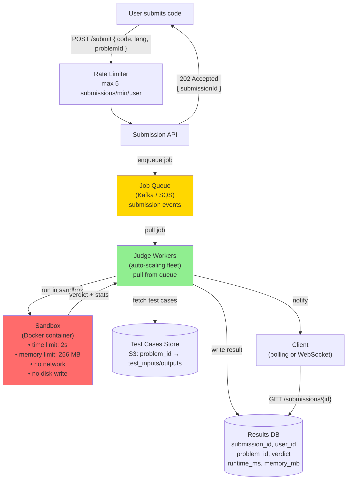

# 14 · LeetCode (Online Judge)

> **Difficulty**: Medium
> **Introduces**: job queue, sandboxed code execution, async result delivery
> **Builds on**: [08 · Rate Limiter](08-rate-limiter.md) — controlling request volume; [07 · Leaderboard](../easy/07-leaderboard.md) — ranking results

---

## How I Should Think About This

An online judge has a fundamental constraint: **user-submitted code is untrusted**. You can't run `while(true){}` or `import os; os.system("rm -rf /")` on your API servers. Every submission must run in an **isolated sandbox** — a container or VM that can be killed after a time limit, has no network access, and can't touch the host filesystem. This isolation is the core of what makes online judges architecturally interesting. The execution itself is a side-effecting, resource-heavy, time-bounded operation — nothing like a normal API call.

The second design challenge is **async result delivery**. Code execution takes 1–30 seconds. You can't hold an HTTP connection open for 30 seconds waiting (connection timeouts, wasted server resources). Instead, the submission is accepted immediately (`202 Accepted`), placed on a **job queue** (Kafka or SQS), and a fleet of Judge Workers pull from the queue, execute in sandboxes, and write results back. The client polls for results or subscribes to a WebSocket for the verdict. This is the async job pattern — accept → queue → process → notify — which appears in any system where work takes more than a second (video transcoding, email sending, report generation).

---

## Whiteboard Diagram



---

## Key Decisions

**1. Sandbox isolation strategies**

| Method | Isolation | Startup time | Used by |
|--------|-----------|-------------|---------|
| **Docker container** | Process isolation, cgroups | ~200ms | Most online judges |
| **gVisor / Firecracker microVM** | Stronger kernel isolation | ~125ms | High-security environments |
| **Language-level sandbox** | JVM SecurityManager, etc. | Near-zero | Weak — not recommended |
| **Nsjail / seccomp** | System-call filtering | ~50ms | LeetCode (likely) |

Key sandbox constraints:
```
- CPU time limit:    2 seconds wall clock
- Memory limit:      256 MB
- Network:           blocked (no outbound connections)
- Filesystem:        read-only except /tmp
- Fork/exec:         blocked (prevents fork bomb)
```

**2. Job queue design**

```
Submit:
  POST /submit → API validates + rate-limits → publishes to Kafka:
  {
    submission_id: "uuid",
    user_id: "u123",
    problem_id: "two-sum",
    language: "python3",
    code: "def twoSum(...):",
    submitted_at: timestamp
  }

Workers:
  - Auto-scale based on queue depth (more submissions → more workers)
  - Each worker pulls one job, runs it to completion, acks
  - If worker crashes mid-execution: Kafka re-delivers (at-least-once)
  - Worker deduplicates by submission_id to avoid double-verdicts
```

**3. Verdict states and result delivery**

```
PENDING   → job in queue, not yet picked up
RUNNING   → worker is executing
ACCEPTED  → all test cases passed
WRONG_ANSWER → failed one or more test cases
TIME_LIMIT_EXCEEDED → ran past 2s limit
MEMORY_LIMIT_EXCEEDED → exceeded 256MB
RUNTIME_ERROR → threw exception or segfaulted
COMPILATION_ERROR → syntax error (caught before queue)
```

Client delivery options:
- **Polling**: `GET /submissions/{id}` every 2 seconds. Simple, works everywhere.
- **WebSocket**: server pushes verdict instantly. Better UX, more infra.
- **SSE**: server-sent stream for the submission status. Good middle ground.

> LeetCode uses polling. For an interview, mention both and say you'd use WebSocket for real-time UX.

---

## Capacity Estimation

```
Submissions/day:  5M (peak during contests: 100K/hour)
Peak QPS:         ~28 submissions/sec
Execution time:   avg 1.5s per submission
Workers needed:   28 submissions/sec × 1.5s = ~42 concurrent workers
(scale to 200 during contests)

Test case storage:
  1000 problems × 100 test cases × 10 KB avg = 1 GB → trivial S3 storage

Result DB:
  5M submissions/day × 500 bytes = 2.5 GB/day → standard RDBMS
```

---

## Concepts Introduced

- **Async job queue pattern** — accept → enqueue → process → notify. The universal pattern for any slow, resource-heavy operation. Reappears in: YouTube transcoding (Q20), Price Tracker (Q21), Notification System (Q22).
- **202 Accepted** — the correct HTTP status for "I got your request, work is happening asynchronously." Contrasts with 200 (synchronous result) and 201 (resource created).
- **Worker auto-scaling** — queue depth drives worker count. More jobs → spin up more workers; queue drains → scale down. The basis of all serverless job processing.
- **Sandbox/container isolation** — every user-submitted code execution problem needs this. Directly reappears in: YouTube transcoding workers (Q20) also run in isolated environments.

---

## What to Study Next

➜ **[15 · Strava](15-strava.md)** — brings together geo (Q06), leaderboards (Q07), and time-series data into one system. The first question where you need to think about how to efficiently query sequential data over time.
