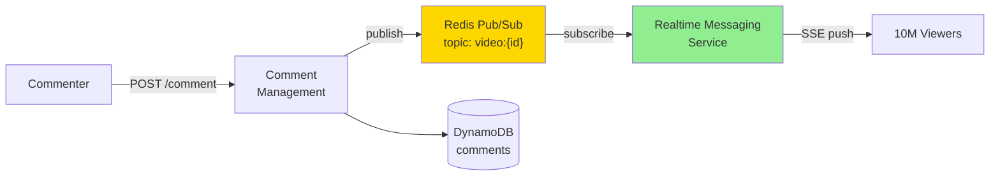

# 16 · FB Live Comments

> **Difficulty**: Medium
> **Introduces**: Server-Sent Events (SSE), Redis pub/sub, fan-out at millions-of-viewers scale
> **Builds on**: [11 · WhatsApp](11-whatsapp.md) — WebSocket + real-time; [10 · FB News Feed](10-fb-news-feed.md) — fan-out patterns

---

> **Full writeup**: This question has a complete, detailed writeup at [07-facebook-live-comments.md](../../07-facebook-live-comments.md), including the whiteboard diagram, all key decisions, and the "How I Should Think About This" mental model.
>
> Read that file in full before continuing. Come back here for the curriculum context.

---

## What This Question Adds to Your Mental Model

After WhatsApp (Q11) you understood WebSocket for 1-to-1 real-time messaging. FB Live Comments is the fan-out version: one message must reach millions of viewers near-simultaneously. That breaks the WebSocket model (you can't hold 10M WebSocket connections open on one server cluster affordably). The two new ideas:

1. **SSE over CDN** — Server-Sent Events are one-way HTTP streams that CDNs can cache and broadcast. For passive viewers who only read comments (not write them), SSE is cheaper and scales to massive audiences through CDN fan-out. WebSocket is reserved for active commenters.

2. **Redis pub/sub for comment routing** — one Redis topic per `videoId`. The Comment Management Service publishes to the topic; Realtime Messaging Service instances subscribe to topics for the videos their connected viewers are watching. The L7 load balancer routes viewers by `videoId` so all viewers of the same video land on the same Realtime Messaging instance.

---

## Concepts Reinforced Here

| Concept | Introduced in | How it appears here |
|---------|--------------|---------------------|
| Fan-out | Q10 (News Feed) | Fan-out to 10M viewers per comment |
| WebSocket | Q11 (WhatsApp) | Commenters use WS; passive viewers use SSE |
| Pub/Sub | — (new here) | Redis channels per videoId |
| L7 routing by key | Q01 (load balancer) | Route by videoId → same RMS instance |

---

## What to Study Next

➜ **[17 · Online Auction](17-online-auction.md)** — returns to the concurrency challenge from Ticketmaster (Q09) but with real-time bidding via WebSocket. Combines WebSocket delivery (Q11) with consistency under contention (Q09).
