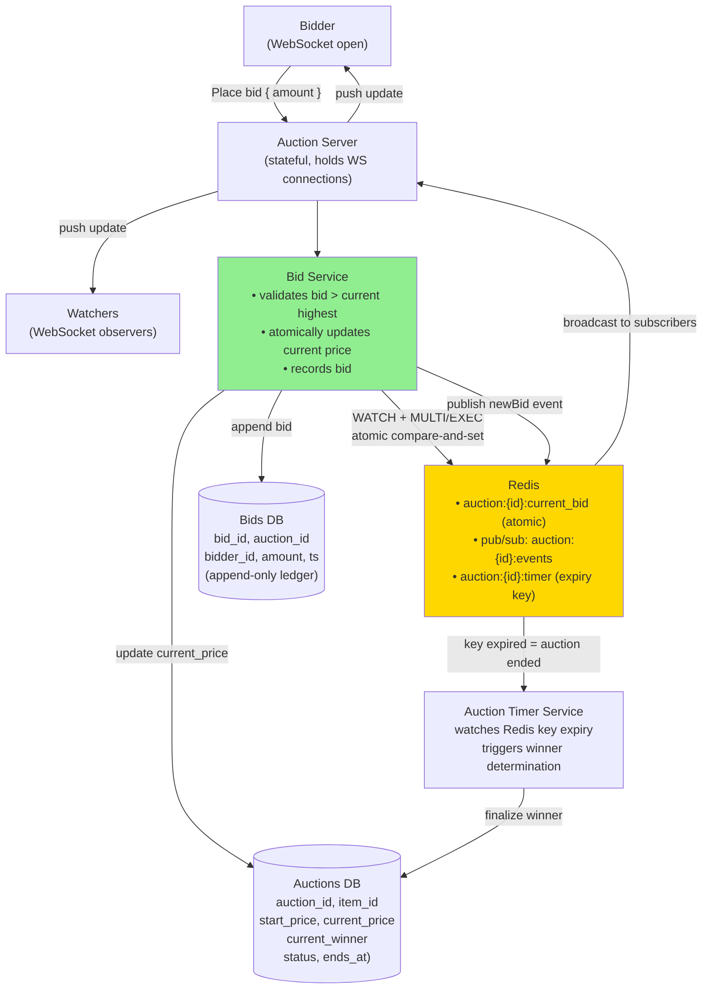
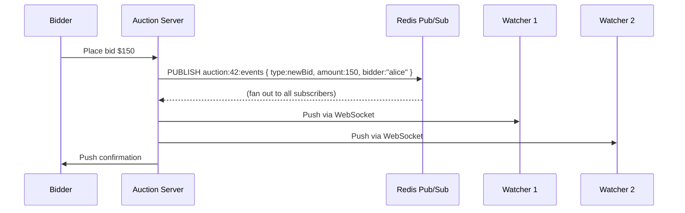

# 17 · Online Auction

> **Difficulty**: Medium
> **Introduces**: real-time bidding via WebSocket, bid ordering consistency, auction lifecycle
> **Builds on**: [09 · Ticketmaster](09-ticketmaster.md) — inventory contention; [11 · WhatsApp](11-whatsapp.md) — WebSocket real-time

---

## How I Should Think About This

An online auction has one hard constraint: **bid ordering must be correct**. If Alice bids $100 and Bob bids $101 at nearly the same millisecond, only Bob's bid should win and Alice should see "you've been outbid." This sounds like the seat reservation problem from Ticketmaster, but there's a key difference: in Ticketmaster, a seat goes to the first person to lock it. In an auction, the *highest* bid wins, regardless of when it arrived — and bids keep coming in until the timer runs out. The system must atomically compare the incoming bid against the current highest bid and only accept it if it's higher.

The second challenge is **real-time broadcast**: every connected bidder should see each new bid within ~200ms. This is exactly the WebSocket broadcast pattern from WhatsApp (Q11) but now the audience is all connected watchers of one auction item, not just two people in a conversation. Redis pub/sub handles this: publish `newBid` events to a channel per auction; all connected bidders receive updates through their WebSocket connection via the auction server that subscribes to that channel. The auction timer expiry is an additional wrinkle — you need a reliable countdown that triggers a winner determination even if no one is bidding near the end.

---

## Whiteboard Diagram



---

## Key Decisions

**1. How do you accept bids atomically?**

The critical check: "is this bid higher than the current highest?" must be **atomic** — no race condition between the check and the update.

```
Using Redis WATCH + MULTI/EXEC (optimistic transaction):

WATCH auction:{id}:current_bid
current = GET auction:{id}:current_bid   ← read current highest

if new_bid <= current:
    DISCARD; return "bid too low"

MULTI
  SET auction:{id}:current_bid new_bid
  SET auction:{id}:current_winner bidder_id
EXEC
  → If someone else changed current_bid between WATCH and EXEC:
     EXEC returns nil → retry
```

Alternative: **Lua script in Redis** (atomic by design, no retry needed):
```lua
local current = redis.call('GET', KEYS[1])
if tonumber(ARGV[1]) > tonumber(current) then
    redis.call('SET', KEYS[1], ARGV[1])
    redis.call('SET', KEYS[2], ARGV[2])
    return 1  -- accepted
end
return 0  -- rejected
```

> Lua script is simpler and eliminates retry logic. This is the standard Redis atomic update pattern.

**2. Real-time bid broadcast to all watchers**



Each Auction Server subscribes to the channels for auctions it has viewers connected for. Redis pub/sub routes the event to the right server; the server pushes to the right WebSocket connections.

**3. Auction timer and ending**

```
Auction creation:
  SET auction:{id}:timer "" EX 3600   ← expires in 1 hour

Timer Service:
  Subscribe to Redis keyspace notifications (expired events)
  On expiry of auction:{id}:timer:
    → Lock auction (status = "closing")
    → Final winner = current_winner from AuctionDB
    → Send notifications to winner and all bidders
    → Trigger payment flow

Anti-snipe extension:
  If bid placed in last 5 minutes: extend timer by 5 minutes
  → Prevents last-second sniping (eBay does this as "anti-snipe")
```

---

## Capacity Estimation

```
Concurrent auctions:    1M
Bidders per auction:    avg 10 active, 100 watchers
WebSocket connections:  1M × 110 = 110M connections (massive — need many servers)
Bids/sec:               1M auctions × 1 bid/10s = 100K bids/sec (at peak)

Redis bid validation:   100K Lua script calls/sec → needs Redis cluster
Broadcast events:       100K events × 110 watchers = 11M pushes/sec
→ Need thousands of Auction Server instances with connection affinity via L7 LB
```

---

## Concepts Introduced

- **Redis Lua scripts for atomic operations** — run read-check-write atomically in Redis. The gold standard for race-condition-free updates. Reappears in: Distributed Cache (Q28), any system requiring atomic state transitions.
- **Redis keyspace notifications** — subscribe to events when keys expire or change. Used here for auction timer; also used for session expiry, cache invalidation triggers.
- **Anti-snipe / bid extension** — a real product pattern worth knowing. Signals understanding of actual auction dynamics, not just the happy path.
- **Connection affinity at scale** — when you have 110M WebSocket connections, you need L7 routing that ensures watchers of the same auction land on the same server (or that all servers subscribe to the auction's Redis channel).

---

## What to Study Next

➜ **[18 · FB Post Search](18-fb-post-search.md)** — introduces Elasticsearch and the inverted index in depth. After Yelp (Q13) where you used ES for business names, now you're using it for full social content — posts, comments, user queries with ranking signals.
