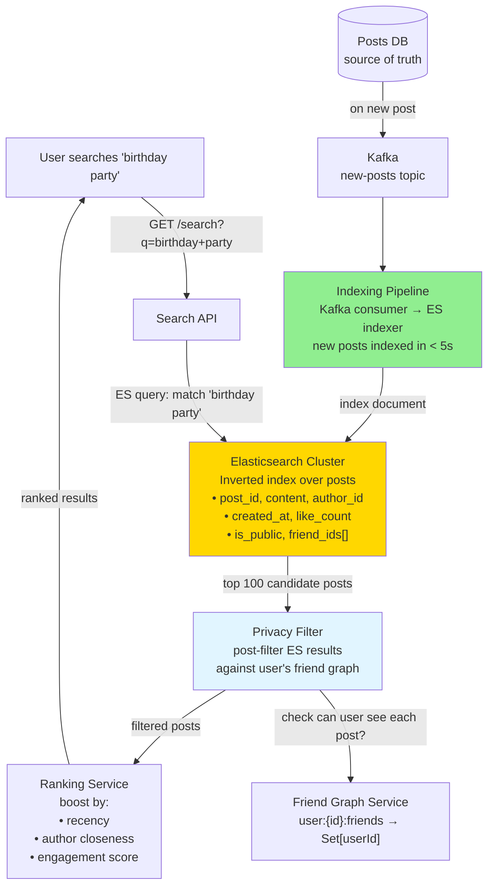

# 18 · FB Post Search

> **Difficulty**: Medium
> **Introduces**: inverted index mechanics, Elasticsearch indexing pipeline, search ranking signals
> **Builds on**: [13 · Yelp](13-yelp.md) — Elasticsearch intro; [10 · FB News Feed](10-fb-news-feed.md) — post data model

---

## How I Should Think About This

Searching Facebook posts is a **full-text search at social-network scale** problem. When someone types "birthday party" into the search bar, the system must find relevant posts from people you follow, public posts, and group posts — ranked by a mix of recency, relevance to your network, and engagement. The foundational technology is an **inverted index**: a data structure that maps each word to the list of documents containing it. `"birthday" → [post_42, post_891, post_2047]`. An intersection of the lists for "birthday" and "party" gives you documents containing both words. This is what Elasticsearch does internally, and it's the reason text search is fast even over billions of documents.

The engineering challenge unique to social search is the **privacy and freshness layers**. A SQL query can enforce privacy with a `WHERE` clause, but Elasticsearch doesn't natively know about friend graphs. You need to either pre-filter what gets indexed (only index posts the searcher can see) or post-filter search results against a privacy lookup. Pre-filtering is expensive to maintain; post-filtering adds latency. The practical approach is **viewer-agnostic indexing with post-filtering** for a small result set. The second challenge is freshness: new posts must appear in search results within seconds of being posted, which means the indexing pipeline (Kafka → ES indexer) must be near-real-time, not a nightly batch.

---

## Whiteboard Diagram



---

## Key Decisions

**1. How the inverted index works**

```
Documents:
  Post 1: "happy birthday to my best friend"
  Post 2: "birthday party at the park tomorrow"
  Post 3: "best party ever at the rooftop"

Inverted index:
  "birthday"  → [post_1, post_2]
  "party"     → [post_2, post_3]
  "best"      → [post_1, post_3]
  "friend"    → [post_1]

Query: "birthday party"
  → intersect("birthday", "party") = [post_2]   ← O(result_size)
  → post_2 is the answer
```

Elasticsearch handles tokenization (lowercasing, stemming: "parties" → "party"), stop words ("the", "at" ignored), and TF-IDF scoring automatically.

**2. Privacy: pre-filter vs post-filter**

```
Pre-filter (index only what user can see):
  ✅ ES results are always valid
  ❌ Must maintain separate index per user or visibility groups
  ❌ Billions of index updates when someone changes privacy settings

Post-filter (index everything, filter after):
  ✅ One unified ES index
  ✅ No re-indexing on privacy changes
  ❌ ES may return 100 results, only 10 survive privacy check
  → Solution: fetch 3× more from ES than you need, filter, return top N
```

> Post-filter is the standard approach. Request 3× results from ES, filter down to N after privacy check.

**3. Search ranking for social content**

Pure text relevance (TF-IDF) isn't enough for social search. You also boost by:

```
final_score = text_relevance_score
            × recency_boost          (newer posts score higher)
            × author_closeness_boost (close friends > strangers)
            × engagement_boost       (more likes/comments = more relevant)
            × media_boost            (posts with photos/videos preferred)
```

Pre-compute `author_closeness` as a graph feature. Store in the ES document at index time. Update nightly. Don't compute at query time (too slow).

---

## Capacity Estimation

```
Posts indexed:     100B total (7 years of Facebook)
New posts/day:     500M → ~6,000 new documents/sec to index

ES cluster size:
  100B docs × 500 bytes avg = 50 TB → large ES cluster (50-100 nodes)
  Shard by created_at month → time-based sharding for hot/cold separation

Search QPS:        1B searches/day → 12,000 RPS
ES response time:  < 100ms for 10-shard query with BM25 scoring
```

---

## Concepts Introduced

- **Inverted index** — the core data structure behind all text search. Every word maps to a list of containing documents. Intersection = query. Reappears in: Web Crawler (Q25) which builds an inverted index for the web.
- **Near-real-time indexing pipeline** — Kafka consumer indexing new posts into ES within seconds. The same pipeline pattern as FB News Feed fan-out (Q10), applied to search indexing.
- **Post-filter with over-fetching** — request 3× results, filter down. The pragmatic solution when you can't pre-filter efficiently. A common pattern when you need to intersect a relevance ranking with an access control check.
- **Time-based shard routing** — store recent posts on hot shards, older posts on cold shards. Reduces index size for hot queries. Reappears in: any time-series search system.

---

## What to Study Next

➜ **[19 · Twitter Timeline](19-twitter-timeline.md)** — builds directly on News Feed (Q10) and Post Search (Q18). Introduces the hybrid fan-out solution for the celebrity problem at Twitter's scale, completing the "feed" pattern trilogy.
