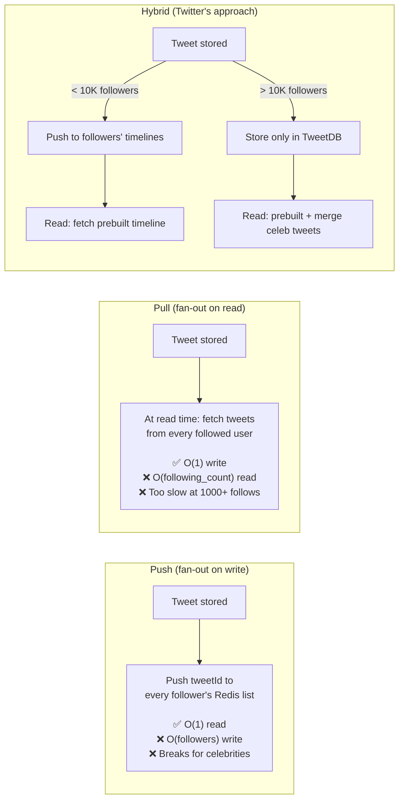

# 19 · Twitter Timeline

> **Difficulty**: Medium
> **Introduces**: hybrid fan-out with celebrity split, social graph storage, timeline merge
> **Builds on**: [10 · FB News Feed](10-fb-news-feed.md) — fan-out patterns; [18 · FB Post Search](18-fb-post-search.md) — post data model

---

## How I Should Think About This

Twitter Timeline is the question where you complete the fan-out mental model you started in FB News Feed (Q10). In Q10 you learned the two extremes: fan-out on write (push to all followers) vs fan-out on read (pull at read time). Twitter's actual production system uses a **hybrid**: fan-out on write for the majority of users, and fan-out on read for celebrities. When Obama tweets, you don't push to his 130M followers' Redis feeds — instead, his tweets are stored in a separate "celebrity tweets" table and merged in at read time. The threshold is typically around 10,000 followers.

The new concept in this question is **graph storage**: who follows whom. Twitter's social graph is a directed graph — Alice follows Bob but Bob may not follow Alice. At Twitter's scale (billions of follow relationships), this graph doesn't fit in a standard relational table with a JOIN at query time. Instead, you denormalize it: store a precomputed list of each user's followers in a Redis set or a dedicated graph DB. The fan-out worker iterates this follower list to push tweets. The size of this list directly determines your fan-out cost, which is why the celebrity threshold matters so much.

---

## Whiteboard Diagram

```mermaid
graph TB
    Tweeter["@obama tweets\n(130M followers)"]
    NormalUser["@alice tweets\n(300 followers)"]

    TweetDB[("Tweets DB\ntweet_id, user_id\ncontent, created_at\nmedia_url")]

    Kafka["Kafka\nnew-tweets topic"]

    FanoutWorker["Fan-out Worker\nchecks follower count\n→ push or skip"]

    FollowerGraph["Follower Graph\nRedis SET: followers:{userId}\nor dedicated graph store"]

    HomeTimeline["Home Timeline Cache\nRedis LIST: timeline:{userId}\n← last 800 tweetIds"]

    TimelineService["Timeline Service\n1. Fetch prebuilt timeline (Redis)\n2. Merge in latest celeb tweets\n3. Return ranked result"]

    CelebTweets[("Celebrity Tweet Store\nfetch latest N tweets\nfrom celebrities user follows)"]

    Tweeter -->|"POST /tweet"| TweetDB
    NormalUser -->|"POST /tweet"| TweetDB
    TweetDB --> Kafka

    Kafka --> FanoutWorker
    FanoutWorker -->|"follower_count < 10K\n→ iterate followers"| FollowerGraph
    FollowerGraph -->|"300 follower IDs"| FanoutWorker
    FanoutWorker -->|"LPUSH timeline:{followerId}\nfor each follower"| HomeTimeline

    FanoutWorker -->|"follower_count > 10K\n→ skip push"| Skip["No fan-out\n(read on demand)"]

    User["User opens timeline"] --> TimelineService
    TimelineService --> HomeTimeline
    TimelineService -->|"fetch celeb tweets"| CelebTweets
    TimelineService -->|"merge + sort by time"| User

    style HomeTimeline fill:#FFD700
    style FanoutWorker fill:#90EE90
    style Skip fill:#e1f5ff
```

---

## Key Decisions

**1. The three fan-out models**



**2. Social graph storage**

```
Option A: Relational table
  follows(follower_id, following_id)
  → Simple but JOINs at fan-out time scan large tables

Option B: Redis sets (hot path)
  SADD followers:{userId} followerA followerB ...
  SMEMBERS followers:{userId}  → all follower IDs instantly

Option C: Dedicated graph DB (Neo4j, Amazon Neptune)
  → Better for "friends of friends" queries
  → Overkill for simple follower lists

Option D: Cassandra list (durable, scalable)
  Partition: user_id
  Values: follower_id list
  → Scales to billions of rows, reads are single-partition
```

> Hybrid: **Cassandra for durable storage + Redis for hot fan-out** (cache the follower list of active users in Redis, fall back to Cassandra).

**3. Timeline storage in Redis**

```
LPUSH timeline:{userId} tweetId     ← prepend new tweet
LTRIM timeline:{userId} 0 799       ← keep only last 800 tweets
LRANGE timeline:{userId} 0 19       ← fetch page 1 (20 tweets)

Why 800 limit:
  → Most users never scroll past 800 tweets
  → Bounded memory per user: 800 × 8 bytes = 6.4 KB
  → 500M users × 6.4 KB = 3.2 TB → manageable Redis cluster
```

---

## Capacity Estimation

```
Users:          300M DAU
Tweets/day:     500M
Avg followers:  200 (most users), 130M (Obama)

Fan-out writes (push model, excluding celebrities):
  500M tweets × 200 followers = 100B Redis writes/day → 1.2M/sec
  (80% of tweets come from users with < 10K followers)

Timeline reads:
  300M users × 10 timeline opens/day = 3B reads/day → 35K RPS
  Redis handles this trivially

Celeb tweet merge cost:
  Each user follows ~5 celebrities on average
  5 × recent tweets fetch = 5 DB reads at timeline load
  35K RPS × 5 = 175K DB reads/sec → cache celebrity timelines in Redis
```

---

## Concepts Introduced

- **Hybrid fan-out with celebrity threshold** — the complete answer to the fan-out problem. Not just "push" or "pull" but a split strategy based on follower count. Reappears in: Twitter at Scale (Q26) where you push this even further.
- **Denormalized follower graph in Redis/Cassandra** — precomputed follower lists for fan-out iteration. The alternative to JOIN-time graph traversal.
- **Redis LPUSH + LTRIM** — the bounded list pattern for home timelines. Cheap prepend, auto-truncating at a fixed size. A simple but powerful pattern for any "recent N items" list.
- **Celebrity tweet merge at read time** — prebuilt timelines + real-time celebrity fetch. The final piece of the feed architecture puzzle.

---

## What to Study Next

➜ **[20 · YouTube](20-youtube.md)** — returns to blob storage from Q04 (Dropbox) but at video scale. Introduces the transcoding pipeline and adaptive bitrate streaming — the infra behind serving video to billions of users.
