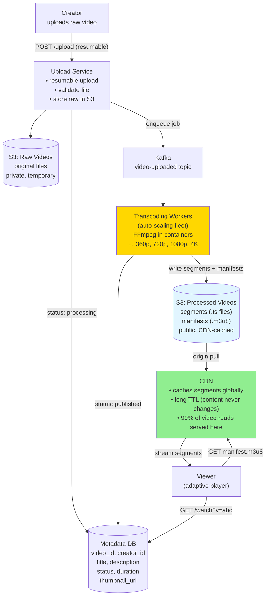

# 20 · YouTube

> **Difficulty**: Medium
> **Introduces**: video transcoding pipeline, adaptive bitrate streaming (HLS), CDN for video delivery
> **Builds on**: [04 · Dropbox](../easy/04-dropbox.md) — blob storage + metadata; [05 · News Aggregator](../easy/05-news-aggregator.md) — pipeline patterns

---

## How I Should Think About This

YouTube is Dropbox but the files are videos, and videos must be **transcoded** before they can be played. A creator uploads a raw 4K .mov file from Final Cut Pro. That file can't be served directly — different devices need different formats and resolutions (4K for a TV, 720p for a phone on 4G, 360p for a slow connection). The transcoding pipeline takes the raw upload and produces 5–8 output renditions automatically: 360p/mp4, 720p/mp4, 1080p/mp4, 4K/webm, and so on. This is a **job queue** problem (Q14) applied to video: upload triggers a transcoding job, workers process it asynchronously, and the video becomes playable once at least one rendition is ready.

The second new concept is **adaptive bitrate streaming (HLS)**. Rather than serving one video file, the player streams a sequence of short segments (2–10 seconds each). A manifest file (`.m3u8`) lists available quality levels and their segment URLs. The player monitors network speed and switches quality level between segments — dropping from 1080p to 480p if bandwidth degrades, climbing back up when it improves. This is why Netflix and YouTube never fully buffer before playing: they start at low quality, assess bandwidth, and ramp up. Each segment is a static file stored in S3 and served via CDN — making video delivery a read-heavy CDN caching problem, not a streaming server problem.

---

## Whiteboard Diagram



---

## Key Decisions

**1. Resumable uploads**

Large video files (10GB+) can't be uploaded in one HTTP request — it'll time out or fail midway. Solution: **chunked resumable upload**.

```
1. POST /upload/init → { uploadId, presignedUrls[part1, part2, ...] }
2. PUT presignedUrl[0] ← 5MB chunk (directly to S3)
3. PUT presignedUrl[1] ← 5MB chunk
4. ...
5. POST /upload/complete { uploadId, eTags[] } → S3 combines parts

If connection drops at chunk 3:
  → Resume from chunk 4 (server tracks which parts received)
```

This is S3 Multipart Upload — a real AWS feature. Knowing this signals familiarity with production uploads.

**2. HLS adaptive bitrate structure**

```
Master manifest (video.m3u8):
  #EXT-X-STREAM-INF:BANDWIDTH=800000,RESOLUTION=640x360
  360p/playlist.m3u8
  #EXT-X-STREAM-INF:BANDWIDTH=3000000,RESOLUTION=1280x720
  720p/playlist.m3u8
  #EXT-X-STREAM-INF:BANDWIDTH=8000000,RESOLUTION=1920x1080
  1080p/playlist.m3u8

Each quality playlist (720p/playlist.m3u8):
  #EXTINF:4.0,
  720p/seg_000.ts
  #EXTINF:4.0,
  720p/seg_001.ts
  ...

Player logic:
  → Download 2s of 360p to start playing immediately
  → Measure bandwidth: 5 Mbps → switch to 720p
  → Bandwidth drops to 1 Mbps → switch back to 360p
```

Each `.ts` segment is a static file in S3/CDN with an infinite TTL — it never changes once created.

**3. Transcoding pipeline: parallelism**

```
Raw video → split into 1-minute GOP chunks
Each chunk transcoded independently in parallel workers:
  Chunk 0: → 360p + 720p + 1080p (parallel)
  Chunk 1: → 360p + 720p + 1080p (parallel)
  ...
Stitch output segments in order

Without parallelism: 1hr video × 10min transcode = 10hr processing time
With parallel chunks: 1hr video → 60 chunks → ~10min with enough workers
```

---

## Capacity Estimation

```
Uploads/day:      500 hours of video/minute = 720K hrs/day
Storage per hour: 1080p = ~4 GB raw; 5 renditions avg 1 GB each = 5 GB processed
Storage/day:      720K × 5 GB = 3.6 PB/day → petabyte-scale S3

Views/day:        1B views
Avg view:         8 minutes of 720p = ~180 MB
CDN bandwidth:    1B × 180 MB = 180 PB/day → major CDN contract

Transcoding fleet:
  500 hrs upload/min × 4× real-time transcoding = 2,000 worker-hours/min
  → ~500 GPU/CPU worker instances (auto-scaling)
```

---

## Concepts Introduced

- **Transcoding pipeline** — video processing as an async job queue (Q14's pattern at scale). Raw → processed in background; user doesn't wait. Reappears in: any media processing system.
- **HLS / adaptive bitrate streaming** — player requests short segments, switches quality based on bandwidth. Decouples streaming from a stateful streaming server; each segment is a static S3/CDN file.
- **Parallel chunk processing** — split work into independent units, process in parallel, reassemble. The same approach as MapReduce. Reappears in: distributed systems, batch processing.
- **Resumable upload** — S3 Multipart Upload for large files. Prevents re-uploading on failure. Any system accepting user file uploads above 100 MB should use this.

---

## What to Study Next

➜ **[21 · Price Tracker](21-price-tracker.md)** — a lighter question that reinforces crawling from Q05 and introduces change detection and event-driven alerting. Good pacing before the final two medium questions.
