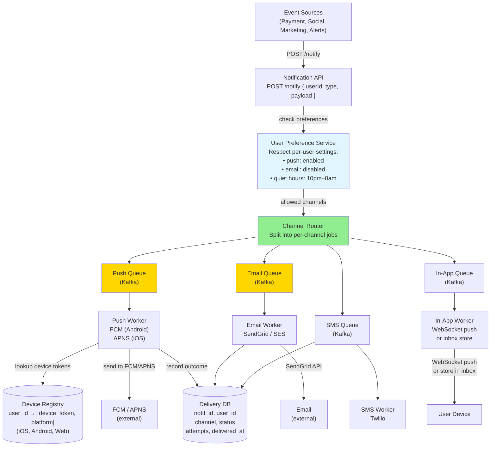
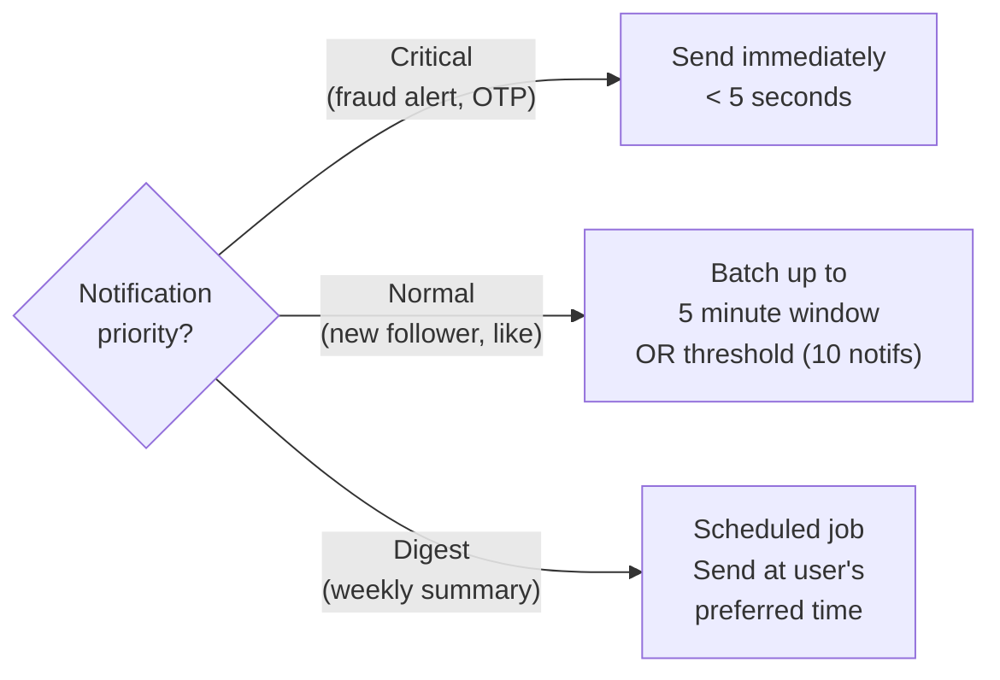

# 22 · Notification System

> **Difficulty**: Medium
> **Introduces**: push notifications (FCM/APNS), multi-channel delivery, batching, user preference enforcement
> **Builds on**: [11 · WhatsApp](11-whatsapp.md) — real-time delivery; [14 · LeetCode Judge](14-leetcode-judge.md) — async job queue; [21 · Price Tracker](21-price-tracker.md) — event-driven alerting

---

## How I Should Think About This

A notification system is **infrastructure**, not an application feature. It's the shared service that every other system in your company calls when something happens that a user should know about. Your job is to design it as a reusable platform: accept notification events from internal services (payments, social, marketing), route them to the right delivery channels (push, in-app, email, SMS), respect user preferences (some users want email but not push), and handle failures gracefully (retry on FCM error, dead-letter if all retries fail). The inputs are events; the outputs are delivered notifications.

The key design insight is that **delivery channels are independent and unreliable**. FCM (Firebase Cloud Messaging for Android) and APNS (Apple Push Notification Service for iOS) are third-party services that can be slow or down. Email via SendGrid can be rate-limited. SMS via Twilio costs money. Your notification service must be able to retry each channel independently, throttle based on user preference (max 3 notifications/hour), batch low-priority notifications (weekly digest vs immediate), and handle the case where a user has multiple devices. The architecture is a pipeline: event → preference check → channel routing → delivery workers per channel → delivery receipt tracking.

---

## Whiteboard Diagram



---

## Key Decisions

**1. User preference enforcement**

```
Per-user settings stored in Redis + DB:
  user:{id}:prefs = {
    push: true,
    email: false,
    sms: false,
    quiet_hours: { start: 22, end: 8, tz: "America/NY" },
    throttle: { max_per_hour: 3, max_per_day: 10 }
  }

Before routing:
  1. Check if channel is enabled by user
  2. Check quiet hours (delay if in quiet period)
  3. Check throttle rate (skip if over limit for this notification type)
  4. Check notification category opt-out (user opted out of "marketing")
```

**2. Retry strategy per channel**

Each channel has different retry behavior:

| Channel | Retry on failure | Max attempts | Backoff |
|---------|-----------------|-------------|---------|
| Push (FCM/APNS) | Yes (transient errors) | 3 | Exponential |
| Email | Yes | 5 | Exponential + jitter |
| SMS | Yes (expensive — be conservative) | 2 | Fixed 30s |
| In-app | If WebSocket fails: store in inbox | Indefinite (inbox) | N/A |

**Dead letter queue**: after all retries exhausted, publish to DLQ for alerting/investigation.

**3. Batching vs immediate delivery**



Batching multiple "X liked your post" notifications into "Alice and 5 others liked your post" reduces notification fatigue and FCM/APNS API call volume.

**4. Device token management**

Each user can have multiple devices (phone, tablet, work phone). The Device Registry must handle:
- **Token refresh**: FCM/APNS tokens rotate periodically → store latest
- **Stale token detection**: if FCM returns `NotRegistered`, delete that token
- **Multi-device fan-out**: send to all devices, first delivery wins (others show as duplicate or are skipped)

---

## Capacity Estimation

```
Notification events/day: 10B (large social platform)
Peak:                     ~200K events/sec

Push notifications:       60% of events = 6B/day → 70K FCM calls/sec at peak
Email:                    20% = 2B/day → 23K emails/sec → multiple email providers
SMS:                      5% = 500M/day (expensive — throttle aggressively)

Delivery workers:
  Each FCM worker: ~5,000 API calls/sec
  Need: 70K ÷ 5K = 14 push worker instances (auto-scaling)

Storage:
  Delivery records: 10B/day × 200 bytes = 2 TB/day (retain 30 days = 60 TB)
```

---

## Concepts Introduced

- **FCM / APNS** — the two main mobile push platforms. FCM = Android (Google). APNS = iOS (Apple). You must send through them; you can't connect directly to users' devices. Both have rate limits, token expiry, and their own delivery guarantees.
- **Multi-channel routing** — same event, different channels for different users. The routing layer is what makes the notification system a *platform* (reusable by any internal service) rather than a feature.
- **Notification batching** — aggregate similar notifications ("5 people liked your post") before delivery. Reduces noise, improves UX, reduces API call volume.
- **Dead letter queue (DLQ)** — undeliverable messages accumulate here for investigation instead of being silently dropped. A must-have in any async pipeline. Reappears in: Web Crawler (Q25), Ad Click Aggregator (Q29).

---

## What to Study Next

➜ **[23 · Uber / Lyft](../hard/23-uber.md)** — your first Hard question. Combines geo matching (Q12), real-time WebSocket (Q11), and system design at extreme scale. You now have all the prerequisites.
